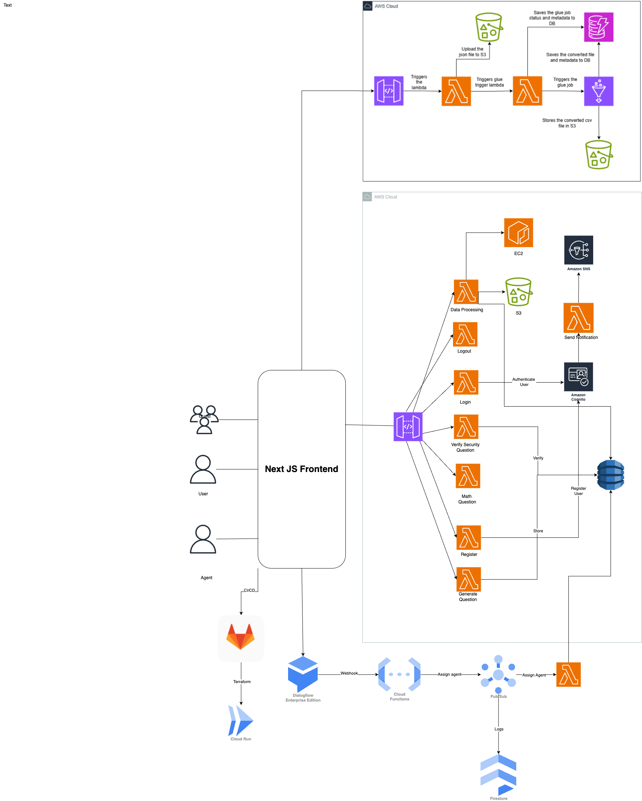

# QuickDataProcessor Project

QuickDataProcessor is a serverless data processing platform designed to leverage various cloud technologies for seamless data processing and analysis. The system ensures scalability, reliability, and efficiency through AWS and GCP services.

## Project Structure

This project is divided into multiple modules:
- **Notifications**: Processes and routes multipart form-data requests using AWS services like Lambda, SNS, and SQS.
- **Message Passing Module**: Facilitates communication between users and agents using GCP Pub/Sub and Firestore.
- **Virtual Assistant**: Powered by GCP Dialogflow, it assists users with navigation and task execution.
- **Data Analysis**: Provides real-time user feedback analysis using GCP’s Natural Language API, Firestore, and BigQuery.

## System Architecture

The architecture diagram illustrates the integration of AWS and GCP services to handle tasks like user requests, message passing, and sentiment analysis.



## Key Features

- **Scalable Notification System**: Sends notifications using AWS SNS.
- **Message Passing**: Employs Pub/Sub for reliable message delivery.
- **Virtual Assistant**: Streamlines user interaction with Dialogflow.
- **Feedback Analysis**: Analyzes customer feedback using Natural Language Processing.

## Prerequisites

- AWS Account with permissions for Lambda, SNS, and SQS.
- GCP Account with access to Pub/Sub, Firestore, and Natural Language API.
- Node.js for executing scripts.

## Installation

1. Clone the repository:
   ```bash
   git clone https://github.com/KavanBrahmbhatt0910/DataProcessingPipeline.git
   cd QuickDataProcessor
   ```
2. Install dependencies:
   ```bash
   npm install
   ```
3. Configure AWS and GCP credentials.

## Usage

1. **Notifications Module**:
   - Ensure AWS SNS and SQS services are configured.
   - Deploy the Lambda functions for notifications.

2. **Message Passing Module**:
   - Deploy the Pub/Sub configuration on GCP.
   - Use the provided Firestore schema for data storage.

3. **Virtual Assistant**:
   - Configure the Dialogflow agent.
   - Deploy webhook functions for Dialogflow intents.

4. **Data Analysis**:
   - Deploy the feedback analysis functions using GCP Cloud Functions.
   - Set up Looker Studio for visualization.

## Testing

Test cases for each module are included in the `tests/` directory. Use the following command to run tests:
```bash
npm test
```

## Authors

- Brahmbhatt Kavankumar Pankajkumar

## License

This project is licensed under the MIT License.

## Contact

For any queries or support, feel free to reach out to:

**Kavankumar Brahmbhatt**  
[Email](mailto:kavanbrahmbhatt0910@gmail.com) | [GitHub](https://github.com/KavanBrahmbhatt0910)


